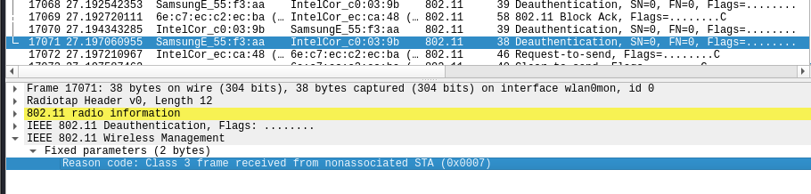
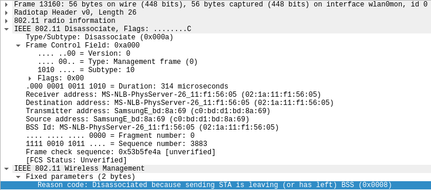

[Livrables](#livrables)

[Échéance](#échéance)

[Quelques pistes importantes](#quelques-pistes-utiles-avant-de-commencer-)

[Travail à réaliser](#travail-à-réaliser)

1. [Deauthentication attack](#1-deauthentication-attack)
2. [Fake channel evil tween attack](#2-fake-channel-evil-tween-attack)
3. [SSID Flood attack](#3-ssid-flood-attack)

# Sécurité des réseaux sans fil

## Laboratoire 802.11 MAC 1

__A faire en équipes de deux personnes__

### Pour cette partie pratique, vous devez être capable de :

*	Détecter si un certain client WiFi se trouve à proximité
*	Obtenir une liste des SSIDs annoncés par les clients WiFi présents

Vous allez devoir faire des recherches sur internet pour apprendre à utiliser Scapy et la suite aircrack pour vos manipulations. __Il est fortement conseillé d'employer une distribution Kali__ (on ne pourra pas assurer le support avec d'autres distributions). __Si vous utilisez une VM, il vous faudra une interface WiFi usb, disponible sur demande__.

__ATTENTION :__ Pour vos manipulations, il pourrait être important de bien fixer le canal lors de vos captures et/ou vos injections (à vous de déterminer si ceci est nécessaire pour les manipulations suivantes ou pas). Si vous en avez besoin, la méthode la plus sure est d'utiliser l'option :

```--channel``` de ```airodump-ng```

et de garder la fenêtre d'airodump ouverte en permanence pendant que vos scripts tournent ou vos manipulations sont effectuées.


## Quelques pistes utiles avant de commencer :

- Si vous devez capturer et injecter du trafic, il faudra configurer votre interface 802.11 en mode monitor.
- Python a un mode interactif très utile pour le développement. Il suffit de l'invoquer avec la commande ```python```. Ensuite, vous pouvez importer Scapy ou tout autre module nécessaire. En fait, vous pouvez même exécuter tout le script fourni en mode interactif !
- Scapy fonctionne aussi en mode interactif en invoquant la commande ```scapy```.  
- Dans le mode interactif, « nom de variable + <enter> » vous retourne le contenu de la variable.
- Pour visualiser en détail une trame avec Scapy en mode interactif, on utilise la fonction ```show()```. Par exemple, si vous chargez votre trame dans une variable nommée ```beacon```, vous pouvez visualiser tous ces champs et ses valeurs avec la commande ```beacon.show()```. Utilisez cette commande pour connaître les champs disponibles et les formats de chaque champ.

## Travail à réaliser

### 1. Deauthentication attack

Une STA ou un AP peuvent envoyer une trame de déauthentification pour mettre fin à une connexion.

Les trames de déauthentification sont des trames de management, donc de type 0, avec un sous-type 12 (0x0c). Voici le format de la trame de déauthentification :


Le corps de la trame (Frame body) contient, entre autres, un champ de deux octets appelé "Reason Code". Le but de ce champ est d'informer la raison de la déauthentification. Voici toutes les valeurs possibles pour le Reason Code :

| Code     | Explication 802.11                                           |
| -------- | ------------------------------------------------------------ |
| 0        | Reserved                                                     |
| 1        | Unspecified reason                                           |
| 2        | Previous authentication no longer valid                      |
| 3        | station is leaving (or has left) IBSS or ESS                 |
| 4        | Disassociated due to inactivity                              |
| 5        | Disassociated because AP is unable to handle all currently associated stations |
| 6        | Class 2 frame received from nonauthenticated station         |
| 7        | Class 3 frame received from nonassociated station            |
| 8        | Disassociated because sending station is leaving (or has left) BSS |
| 9        | Station requesting (re)association is not authenticated with responding station |
| 10       | Disassociated because the information in the Power Capability element is unacceptable |
| 11       | Disassociated because the information in the Supported Channels element is unacceptable |
| 12       | Reserved                                                     |
| 13       | Invalid information element, i.e., an information element defined in this standard for which the content does not meet the specifications in Clause 7 |
| 14       | Message integrity code (MIC) failure                         |
| 15       | 4-Way Handshake timeout                                      |
| 16       | Group Key Handshake timeout                                  |
| 17       | Information element in 4-Way Handshake different from (Re)Association Request/Probe Response/Beacon frame |
| 18       | Invalid group cipher                                         |
| 19       | Invalid pairwise cipher                                      |
| 20       | Invalid AKMP                                                 |
| 21       | Unsupported RSN information element version                  |
| 22       | Invalid RSN information element capabilities                 |
| 23       | IEEE 802.1X authentication failed                            |
| 24       | Cipher suite rejected because of the security policy         |
| 25-31    | Reserved                                                     |
| 32       | Disassociated for unspecified, QoS-related reason            |
| 33       | Disassociated because QAP lacks sufficient bandwidth for this QSTA |
| 34       | Disassociated because excessive number of frames need to be acknowledged, but are not acknowledged due to AP transmissions and/or poor channel conditions |
| 35       | Disassociated because QSTA is transmitting outside the limits of its TXOPs |
| 36       | Requested from peer QSTA as the QSTA is leaving the QBSS (or resetting) |
| 37       | Requested from peer QSTA as it does not want to use the mechanism |
| 38       | Requested from peer QSTA as the QSTA received frames using the mechanism for which a setup is required |
| 39       | Requested from peer QSTA due to timeout                      |
| 40       | Peer QSTA does not support the requested cipher suite        |
| 46-65535 | Reserved                                                     |

a) Utiliser la fonction de déauthentification de la suite aircrack, capturer les échanges et identifier le Reason code et son interpretation.

__Question__ : quel code est utilisé par aircrack pour déauthentifier un client 802.11. Quelle est son interpretation ?

---

> C'est le code 7 qui est utilisé :
>
> 
>
> Ce code signifie que la station a tenté de communiquer sans être associée à l'AP. Il s'agit du code donné par défaut par aireplay lors de l'attaque.

---


__Question__ : A l'aide d'un filtre d'affichage, essayer de trouver d'autres trames de déauthentification dans votre capture. Avez-vous en trouvé d'autres ? Si oui, quel code contient-elle et quelle est son interpretation ?

---

> Nous avons pu capturer des centaines d'autres trames de déauthentification. D'autres codes apparaissent, comme les codes 6, 8 ou 23 (0x0006, 0x0008 ou 0x0017).
>
> 
>
> Ce code signifie que la station a tenté de communiquer sans être authentifiée.
>
> 
>
> Ce code signifie que la station est partie volontairement.
>
> 
>
> Ce code signifie que la station a échoué la phase d'authentification.

---

b) Développer un script en Python/Scapy capable de générer et envoyer des trames de déauthentification. Le script donne le choix entre des Reason codes différents (liste ci-après) et doit pouvoir déduire si le message doit être envoyé à la STA ou à l'AP :

* 1 - Unspecified
* 4 - Disassociated due to inactivity
* 5 - Disassociated because AP is unable to handle all currently associated stations
* 8 - Deauthenticated because sending STA is leaving BSS

---

> **Fonctionnement du script :**
>
> Sur la capture ci-dessous, nous constatons que nous avons donné les adresses :
>
> * *EC:9B:F3:55:F3:AA* pour l'AP
> * *AE:94:BA:16:F3:D9* pour le client
>
> En bleu, nous avons donné le code 4 signifiant que c'est l'AP qui va envoyer le code au client. En rouge, nous avons donné le code 8 signifiant que c'est le client qui va envoyer le code à l'AP.
>
> 
>
> Nous le confirmons ensuite avec Wireshark. 
>
> 
>
> Comme on le constate ci-dessous, c'est bien le code 4 qui est utilisé (source: AP, destination: client)
>
> 

---

__Question__ : quels codes/raisons justifient l'envoi de la trame à la STA cible et pourquoi ?

---

> Le code 1 n'est pas spécifique ; il peut donc être utilisé dans ce contexte. Les codes 4 et 5 peut être envoyés par l'AP respectivement : 
>
> * lorsqu'un client est inactif trop longtemps
> * lorsque l'AP possède trop de connexions avec des clients et qu'elle ne peut plus en gérer autant

---

__Question__ : quels codes/raisons justifient l'envoi de la trame à l'AP et pourquoi ?

---

> Le code 1 étant générique, il peut aussi être envoyé à l'AP par la station cliente. Le code 8 peut être utilisé lorsqu'un client se déconnecte de l'AP, lui indiquant son départ.

---

__Question__ : Comment essayer de déauthentifier toutes les STA ?

---

>Nous pouvons envoyer la trame de déauthentification à l'adresse _FF:FF:FF:FF:FF:FF_, qui est l'adresse MAC de broadcast. De ce fait, toutes les stations clientes vont recevoir et traiter la trame.

---

__Question__ : Quelle est la différence entre le code 3 et le code 8 de la liste ?

---

> Les codes sont les suivants :
>
> * La raison 3 : _Deauthenticated because sending STA is leaving (or has left) IBSS or ESS_
> * La raison 8 : _Disassociated because sending STA is leaving (or has left) BSS_
>
> Pour rappel, IBSS (_Independant Basic Service Set_) représente un groupe de stations communiquant entre elles sans AP. 
>
> 
>
> A l'inverse, un BSS est un groupe de stations communiquant via un AP. Plusieurs BSS peuvent communiquer via leur AP dans un groupe appelé ESS (_Extended Service Set_).
>
> 
>
> Lorsqu'une déauthentification a lieu (code 3), cela signifie qu'une station (STA ou AP) s'est déconnectée. La raison 8, elle, concerne une dissociation entre une STA et un AP. Cela indique que la station cliente a été associée à un autre AP.

---

__Question__ : Expliquer l'effet de cette attaque sur la cible

---

> Cette attaque permet de déconnecter une personne du réseau wifi auquel elle est connectée. Elle peut avoir plusieurs buts :
>
> - Provoquer un déni de service ciblé (DoS)
> - Mettre en place une attaque du type "_Evil twin access point_" en forçant l'utilisateur à se déconnecter de son réseau de confiance afin qu'il se reconnecte sur un point accès malicieux
> - Effectuer une attaque du type "_Password attack_". Pour la mettre en place, il est nécessaire de récupérer le _4-way handshake_ réalisé entre l'AP et l'utilisateur lors de sa connexion pour ensuite faire une attaque par brute-force ou par dictionnaire sur son mot de passe.

---

### 2. Fake channel evil twin attack

a)	Développer un script en Python/Scapy avec les fonctionnalités suivantes :

* Dresser une liste des SSID disponibles à proximité
* Présenter à l'utilisateur la liste, avec les numéros de canaux et les puissances
* Permettre à l'utilisateur de choisir le réseau à attaquer
* Générer un beacon concurrent annonçant un réseau sur un canal différent se trouvant à 6 canaux de séparation du réseau original

__Question__ : Expliquer l'effet de cette attaque sur la cible

---

> Cette attaque doit être combinée avec un peu de _phishing_. En effet, nous allons faire en sorte que la cible se connecte sur notre AP. 
>
> Nous aurons préalablement configuré notre WiFi afin qu'il possède le même nom que l'ancien afin que l'attaque gagne en discrétion. Le nom permet simplement à l'humain de différencier les réseaux : pour la machine, ce qui les différencie c'est l'adresse MAC. Ceci nous permet d'ailleurs d'avoir plusieurs réseaux avec les même nom. 
>
> Il va ensuite être nécessaire de déauthentifier la cible, typiquement avec aireplay. Le but est de l'empêcher de s'y reconnecter en l'inondant de trames de déauthentification. C'est là que la victime va regarder ce qui ne va pas dans le panneau Wi-Fi et éventuellement choisir le nôtre, possédant le même nom que le sien.
>
> Enfin, avec une fausse page de login que nous avons conçue, nous demandons à l'utilisateur de rentrer le mot de passe de son réseau, en prétendant par exemple une mise à jour de l'AP pour justifier la demande. Si l'utilisateur ne possède pas un minimum de notions en réseau (et un peu de jugeote), il entrera sans broncher le mot de passe de son réseau WiFi. Dès lors, nous pouvons essayer directement de nous y connecter (et lui redemander le mot de passe le cas échéant).
>
> Voici une capture d'écran de notre attaque :
>
> 

---

### 3. SSID flood attack

Développer un script en Python/Scapy capable d'inonder la salle avec des SSID dont le nom correspond à une liste contenue dans un fichier text fournit par un utilisateur. Si l'utilisateur ne possède pas une liste, il peut spécifier le nombre d'AP à générer. Dans ce cas, les SSID seront générés de manière aléatoire.

---

> Le résultat de notre script une fois lancé :
>
> 
>
> Ci-dessus, nous avons demandé au script de générer 7 SSIDs. 
>
> Il a ensuite inondé le réseau de *Beacon frames* avec des noms générés.

---

## Livrables

Un fork du repo original. Puis, un Pull Request contenant :

- Script de Deauthentication de clients 802.11 __abondamment commenté/documenté__

- Script fake chanel __abondamment commenté/documenté__

- Script SSID flood __abondamment commenté/documenté__

- Captures d'écran du fonctionnement de chaque script

- Réponses aux éventuelles questions posées dans la donnée. Vous répondez aux questions dans votre ```README.md``` ou dans un pdf séparé

- Envoyer le hash du commit et votre username GitHub par email au professeur et à l'assistant


## Échéance

Le 9 mars 2020 à 23h59